<div align="center">   </div>

<h5 align="center">关于 Github 中红队向工具 / 资源的手册</h5>

<h5 align="center">适用于红队行动 / 蓝队自动化工具对抗调研</h5>


# 0x00 项目简介

**关于 Github 中红队向工具 / 资源的手册** 

**旨在通过应用场景 / 标签对开源项目进行分类收集 降低红队技术门槛**

**带 🌟 项目为个人在实战中体验较好 或在原项目基础上进行重构优化的改版项目**

**本项目倾向：**

- **能实际解决攻防项目中场景化问题的项目**
- **使用新型的、非传统语言（例如 Golang）编写的项目**
- **近一年还在持续更新维护的项目**

**后续计划：**

- **对实战场景进行进一步细分（但是不代表某个项目只能用于该场景）**
- **收录依据实战场景诞生的 1+1>2 的组合拳项目**
- **汇总对应项目相关的使用指南或实战案例文章**

**项目灵感来源于  [Knownsec/404StarLink2.0-Galaxy](https://github.com/knownsec/404StarLink2.0-Galaxy)**

**欢迎对本项目感兴趣的师傅们 Star / Fork 以及提 Issue 一起交流讨论 共同维护💡**

## 目录

**推荐移步 [WIKI](https://github.com/lintstar/About-Attack/wiki) 阅读**

> 声明：本手册仅供红队方向安全研究使用 禁止一切非法行为！


# 0x01 资产探测

## ShuiZe_0x727 🌟【综合】

    

### Link

https://github.com/0x727/ShuiZe_0x727

### About

协助红队人员快速的信息收集，测绘目标资产，寻找薄弱点。

一条龙服务，只需要输入根域名即可全方位收集相关资产，并检测漏洞。也可以输入多个域名、C段IP等。


## Autoscanner【综合】

   

### Link

https://github.com/zongdeiqianxing/Autoscanner

### About

AutoScanner是一款自动化扫描器，其功能功能分为：

- 遍历所有子域名、子域名主机所有端口及所有http端口服务
- 对子域名主机信息进行相关检测，如cname解析判断是否是cdn、域名定位信息判断是否为云服务器、masscan扫端口、nmap等
- 对http端口服务截图、使用集成的工具如crawlergo、xray、dirsearch等进行扫描；
- 集成扫描报告

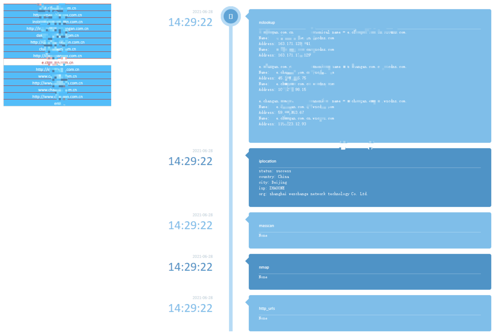

## Bufferfly【综合】

   

### Link

https://github.com/dr0op/bufferfly

### About

攻防资产处理小工具，对攻防前的信息搜集到的大批量资产/域名进行存活检测、获取标题头、语料提取、常见web端口检测、简单中间识别，去重等，便于筛选有价值资产。

```
    __          ________          ______     
   / /_  __  __/ __/ __/__  _____/ __/ /_  __
  / __ \/ / / / /_/ /_/ _ \/ ___/ /_/ / / / /
 / /_/ / /_/ / __/ __/  __/ /  / __/ / /_/ / 
/_.___/\__,_/_/ /_/  \___/_/  /_/ /_/\__, /  
                                    /____/      v1.2.1 
1.高速资产存活检测，获取标题
2.常见Web端口访问测试/获取标题  lxml方式速度较快
3.资产去重
4.随机UA
5.C段web端口探测/获取标题
6.C段识别
7.shiro识别
8.简单中间件识别

适用用于外网资产梳理

TODO:
1.在不发送更多请求的情况下模糊识别weblogic/jboss/jenkins/zabbix/activeMQ/solr/gitlab/spring等
2.常见端口扫描(22/445/3389/3306/6379/1521等常见端口  与masscan、nmap结合)
```


## ARL 资产侦察灯塔系统【综合】

    

### Link

https://github.com/TophantTechnology/ARL

### About

ARL (Asset Reconnaissance Lighthouse) 资产侦察灯塔系统旨在快速侦察与目标关联的互联网资产，构建基础资产信息库。 协助甲方安全团队或者渗透测试人员有效侦察和检索资产，发现存在的薄弱点和攻击面。


## AppInfoScanner【移动端】

   

### Link

https://github.com/kelvinBen/AppInfoScanner

### About

一款适用于以HW行动/红队/渗透测试团队为场景的移动端 (Android、iOS、WEB、H5、静态网站) 信息收集扫描工具，可以帮助渗透测试工程师、攻击队成员、红队成员快速收集到移动端或者静态WEB站点中关键的资产信息并提供基本的信息输出,如：Title、Domain、CDN、指纹信息、状态信息等。


## Ksubdomain【子域】

   

### Link

https://github.com/knownsec/ksubdomain

### About

Ksubdomain 是一款基于无状态子域名爆破工具，支持在 Windows/Linux/Mac 上使用，它会很快的进行 DNS 爆破。

特性

- ksubdomain的发送和接收是分离且不依赖系统，即使高并发发包，也不会占用系统描述符让系统网络阻塞
- ksubdomain有丢包重发机制(这样意味着速度会减小，但比普通的DNS爆破快很多)，会保证每个包都收到DNS服务器的回复，漏报的可能性很小。

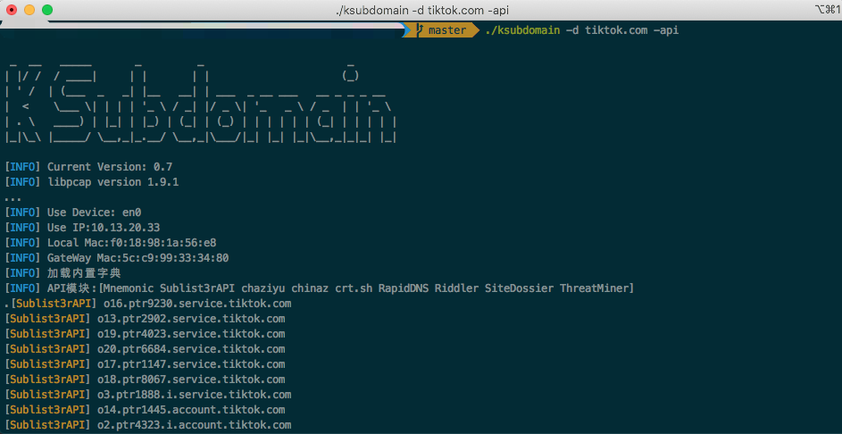


## OneForAll 🌟【子域】

   

### Link

https://github.com/shmilylty/OneForAll

### About

OneForAll是一款功能强大的子域收集工具


## JSINFO-SCAN【JS】

   

### Link

https://github.com/p1g3/JSINFO-SCAN

### About

一款递归爬取域名 (netloc/domain)，以及递归从 JS 中获取信息的工具

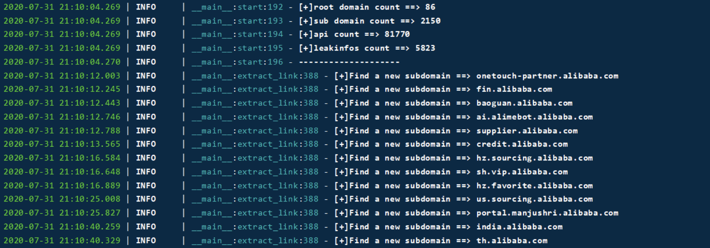


## Bscan【指纹】

   

### Link

https://github.com/broken5/bscan

### About

WebAliveScan Golang 重构版

特性：

- **配置文件采用YAML**，配置文件简洁、可读性高
- **安装简单**，Windows/Linux/Mac下载对应的编译版本即可一键扫描，不用担心环境报错
- **速度快**，在2H4G5M的Linux服务器下，1024线程判断100万条URL存活仅需20分钟
- **自定义**，不管是POC还是默认的HTTP请求，都支持自定义HTTP请求参数、请求头等等
- **指纹识别**，根据自定义的指纹规则对WEB进行标记
- **黑名单过滤**，根据自定义的规则过滤无效页面，例如默认的CDN、WAF页面、500、404、403....
- **最小化扫描**，可以自定义POC过滤规则，对存活WEB对象进行filter处理，防止无效的POC攻击

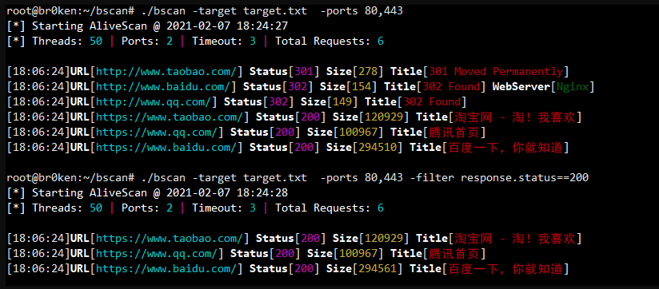


## Glass (镜) V2.0【指纹】

   

### Link

https://github.com/s7ckTeam/Glass

### About

Glass是一款针对资产列表的快速指纹识别工具，通过调用Fofa/ZoomEye/Shodan/360等api接口快速查询资产信息并识别重点资产的指纹，也可针对IP/IP段或资产列表进行快速的指纹识别。

Glass旨在帮助红队人员在资产信息收集期间能够快速从C段、大量杂乱的资产中精准识别到易被攻击的系统，从而实施进一步测试攻击。


## EHole (棱洞) 3.0 🌟【指纹】

   

### Link

https://github.com/EdgeSecurityTeam/EHole

### About

EHole是一款对资产中重点系统指纹识别的工具，在红队作战中，信息收集是必不可少的环节，如何才能从大量的资产中提取有用的系统(如OA、VPN、Weblogic...)。EHole旨在帮助红队人员在信息收集期间能够快速从C段、大量杂乱的资产中精准定位到易被攻击的系统，从而实施进一步攻击。


## Dismap【指纹】

   

### Link

https://github.com/zhzyker/dismap

### About

Asset discovery and identification tools 快速识别 Web 指纹信息，定位资产类型。辅助红队快速定位目标资产信息，辅助蓝队发现疑似脆弱点。

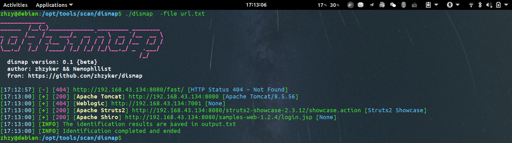


## HostCollision【Host 碰撞】

   

### Link

https://github.com/pmiaowu/HostCollision

[WEB非实用之host碰撞挖掘](https://www.yuque.com/pmiaowu/bomi9w/tbuaca)

### About

用于host碰撞而生的小工具,专门检测渗透中需要绑定hosts才能访问的主机或内部系统

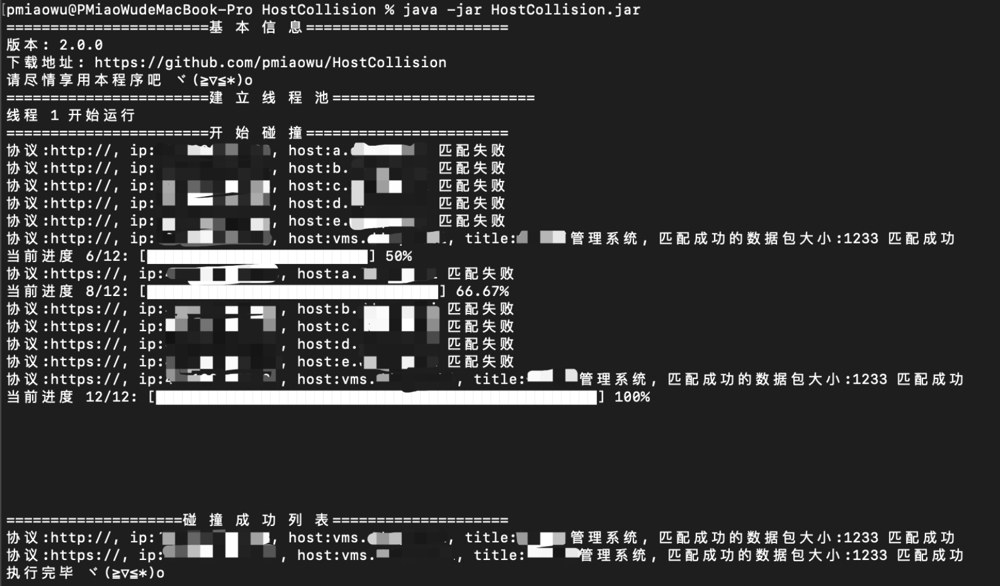


## TheHarvester【邮箱】

   

### Link

https://github.com/laramies/theHarvester

### About

邮箱、子域等开源网络情报收集

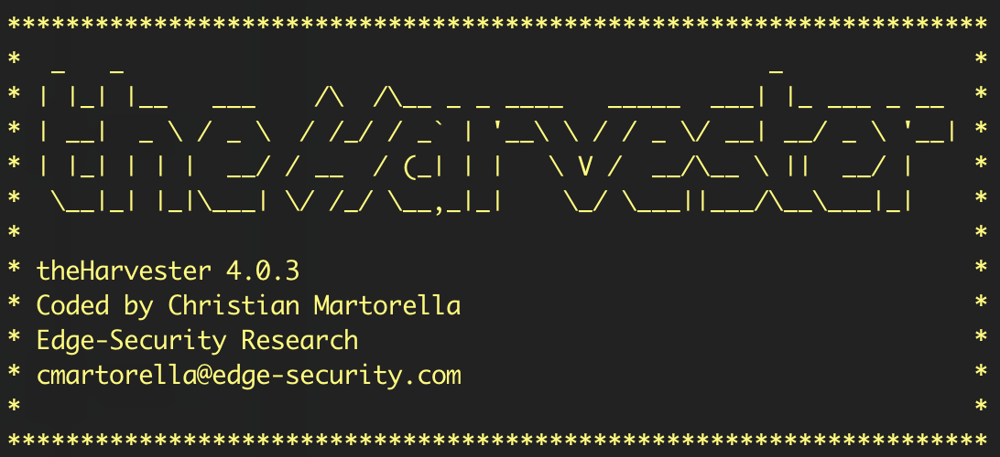


# 0x02 漏洞扫描

## Xray 🌟【Web】

   

### Link

https://github.com/chaitin/xray

https://docs.xray.cool

### About

一款由多名经验丰富的一线安全从业者呕心打造而成完善的安全评估工具


## W13scan【Web】

   

### Link

https://github.com/w-digital-scanner/w13scan

### About

W13scan 是基于Python3的一款开源的Web漏洞发现工具,它支持主动扫描模式和被动扫描模式，能运行在Windows、Linux、Mac上。


## Vulmap 🌟【Web】

   

### Link

https://github.com/zhzyker/vulmap

### About

Vulmap 是一款 web 漏洞扫描和验证工具, 可对 webapps 进行漏洞扫描, 并且具备漏洞验证功能

**可以和 Dismap 进行联动**


## Goby【主机】

   

### Link

https://github.com/gobysec/Goby

https://gobies.org/

### About

Goby是一款新的网络安全测试工具，它能够针对一个目标企业梳理最全的攻击面信息，同时能进行高效、实战化漏洞扫描，并快速的从一个验证入口点，切换到横向。

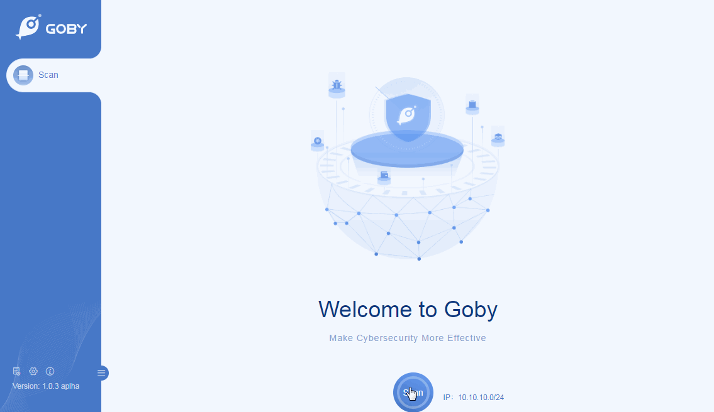


# 0x03 打点突破

## LiqunKit 🌟【综合】

   

### Link

https://github.com/Liqunkit/LiqunKit_

### About

漏洞辅助工具箱

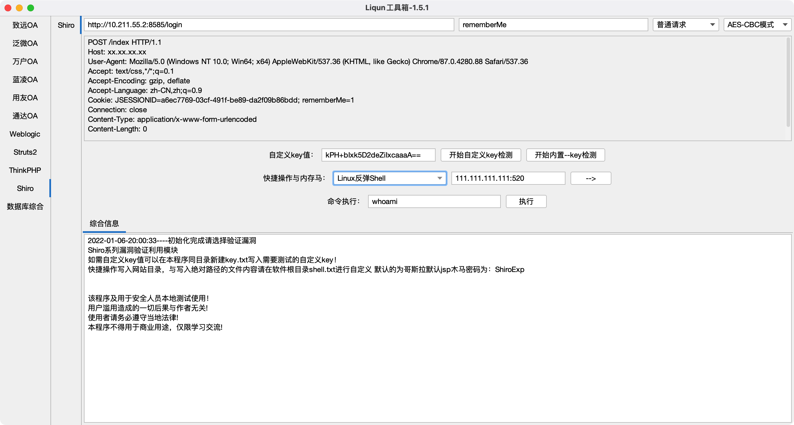


## Ysomap 🌟【ysoserial】

   

### Link

https://github.com/wh1t3p1g/ysomap

[YSOMAP食用指北](https://github.com/wh1t3p1g/ysomap/wiki/YSOMAP%E9%A3%9F%E7%94%A8%E6%8C%87%E5%8C%97)

### About

Ysomap 是一款适配于各类实际复杂环境基于 ysoserial 的 Java反序列化利用框架

-  [tabby](https://github.com/wh1t3p1g/tabby) 的子项目
- 生成序列化后的payload
- 利用ysomap的exploit包进行攻击

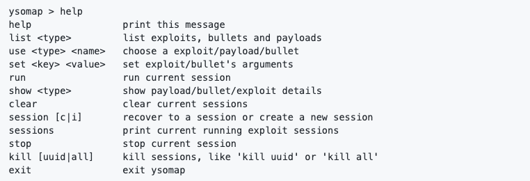


## Shiro_attack 🌟【Shiro】

   

### Link

https://github.com/j1anFen/shiro_attack

### About

Shiro反序列化漏洞综合利用,包含（回显执行命令/注入内存马）

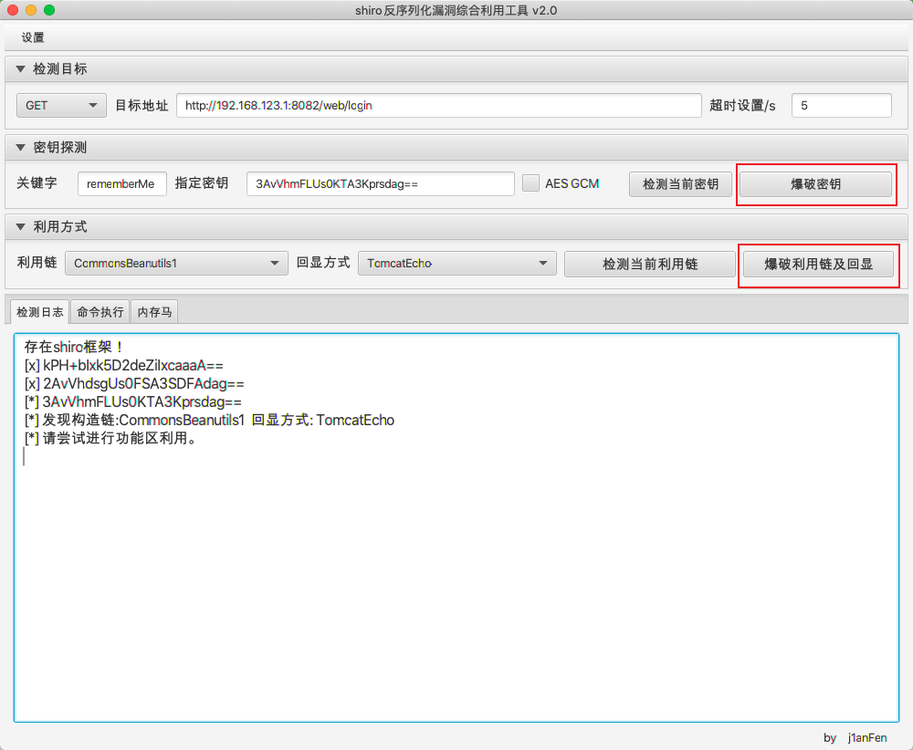


## Weblogic_exploit  🌟【Weblogic】

### Link

[Weblogic常见高危漏洞的综合利用](https://mp.weixin.qq.com/s?__biz=MzIyNzY1MzUxMQ==&mid=100000071&idx=1&sn=5eaab2602d9f022a82f0d2c5d4b0ef5d&chksm=685ca3af5f2b2ab9423268185c1ea7eddd65680991802794e411f3d95746602ea8797e3c7cf4#rd)

https://github.com/21superman/weblogic_exploit （原地址已丢失 😔 ）

### About

最好用的 Weblogic 反序列化 RCE 图形化利用工具

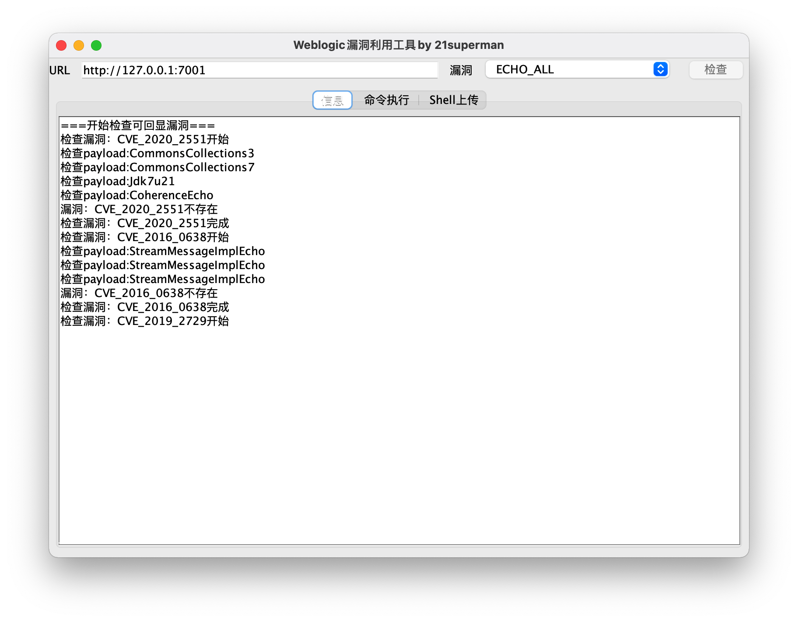


## Struts2VulsTools 🌟【Struts2】

   

### Link

https://github.com/shack2/Struts2VulsTools

### About

Struts2系列漏洞检查工具

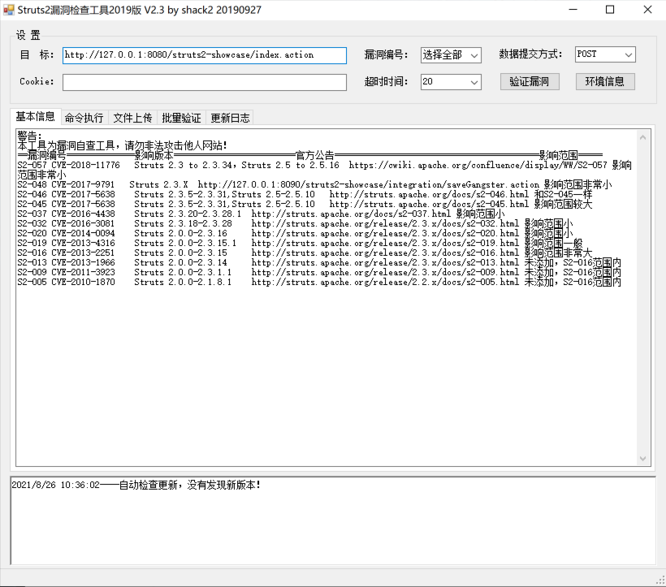


## JNDIExploit 🌟【JNDI】

   

### Link

https://github.com/0x727/JNDIExploit

### About

一款用于 `JNDI注入` 利用的工具，大量参考/引用了 `Rogue JNDI` 项目的代码，支持直接 `植入内存shell`，并集成了常见的 `bypass 高版本JDK` 的方式，适用于与自动化工具配合使用。

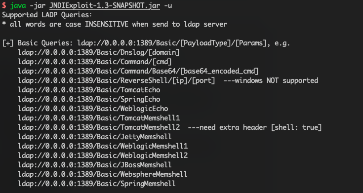


## SpringBootExploit 🌟【SpringBoot】

   

### Link

https://github.com/0x727/SpringBootExploit

### About

一款针对 SpringBootEnv 页面进行快速漏洞利用的工具

**推荐配合上一个项目 JNDIExploit 使用**

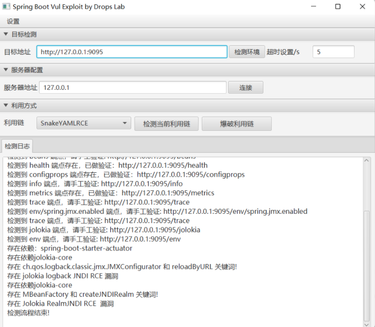


## Fastjson_rce_tool【Fastjson】

   

### Link

https://github.com/wyzxxz/fastjson_rce_tool

### About

Fastjson命令执行自动化利用工具， remote code execute，JNDI服务利用工具 RMI/LDAP，LDAP反序列方式部分回显

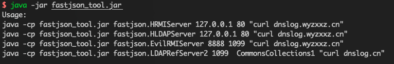


## ThinkphpGUI【Thinkphp】

   

### Link

https://github.com/Lotus6/ThinkphpGUI

### About

Thinkphp(GUI)漏洞利用工具，支持各版本TP漏洞检测，命令执行，Getshell

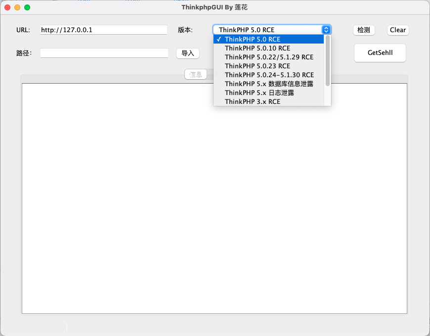


## Redis RCE【Redis】

   

### Link

https://github.com/Ridter/redis-rce

### About

Redis 4.x/5.x RCE的漏洞利用，基于 redis-rogue-server 改版。

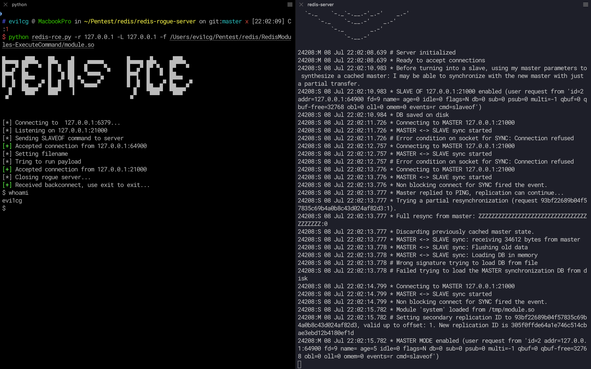


## RabR【Redis】

   

### Link

https://github.com/0671/RabR

### About

Redis-Attack By Replication (通过主从复制攻击Redis)

- 攻击Linux下的Redis，可执行命令和反弹shell
- 攻击Window x64下的Redis，可执行命令
- 本工具在攻击前会备份目标Redis的数据，在攻击结束后会进行恢复

本工具基于**Ridter**师傅的[**redis-rce**](https://github.com/Ridter/redis-rce) 进行修改。

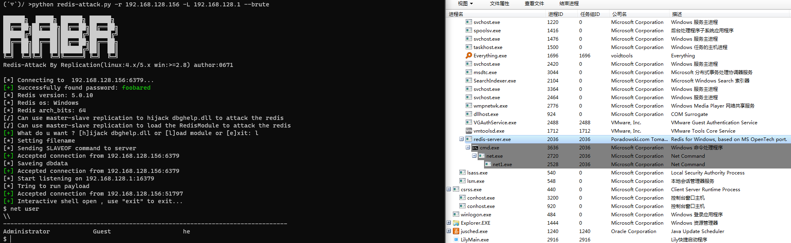


## MDUT 🌟【数据库】

   

### Link

https://github.com/SafeGroceryStore/MDUT

### About

MDUT 全称 Multiple Database Utilization Tools，是一款中文的数据库跨平台利用工具，集合了多种主流的数据库类型。基于前人 SQLTOOLS 的基础开发了这套程序(向 SQLTOOLS 致敬)，旨在将常见的数据库利用手段集合在一个程序中，打破各种数据库利用工具需要各种环境导致使用相当不便的隔阂。

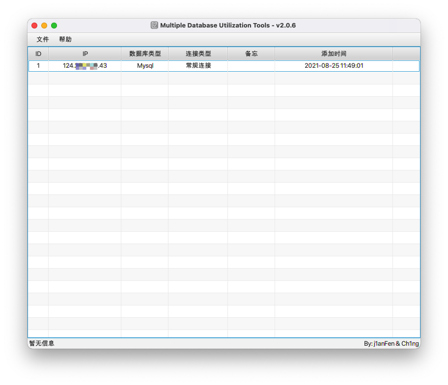

## Seeyon_exp【致远】

   

### link

https://github.com/Summer177/seeyon_exp

### About

致远OA漏洞检查与利用工具

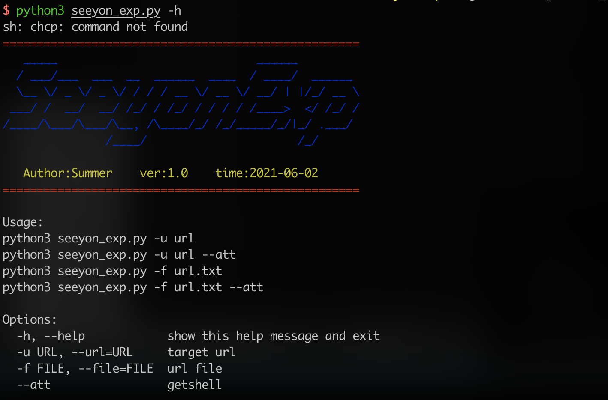


## TDOA_RCE【通达】

   

### Link

https://github.com/xinyu2428/TDOA_RCE

### About

通达OA综合利用工具

- 任意用户登录POC: 4个 + 1个
- SQL注入POC: 2个
- 后台文件上传POC: 3个
- 本地文件包含POC: 2个
- 前台文件上传POC(非WEB目录): 1个
- 任意文件删除POC: 1个
- SSRF+Redis利用链: 1个

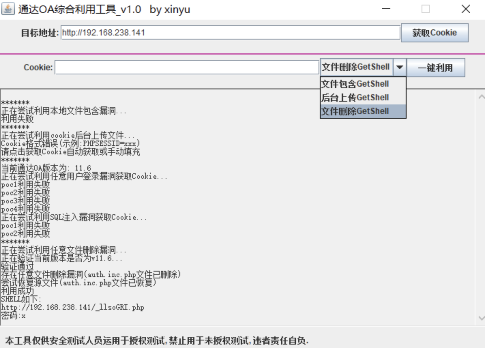


# 0x04 主机管理

## Godzilla 🌟【哥斯拉】

   

### Link

https://github.com/BeichenDream/Godzilla

### About

哥斯拉

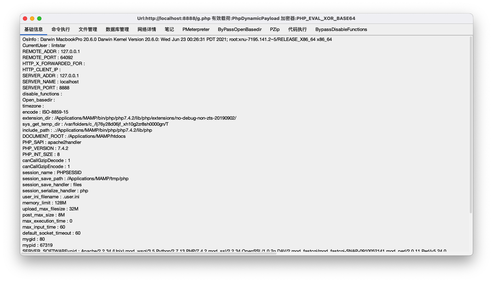


## Behinder【冰蝎】

   

### Link

https://github.com/rebeyond/Behinder

### About

“冰蝎”动态二进制加密网站管理客户端

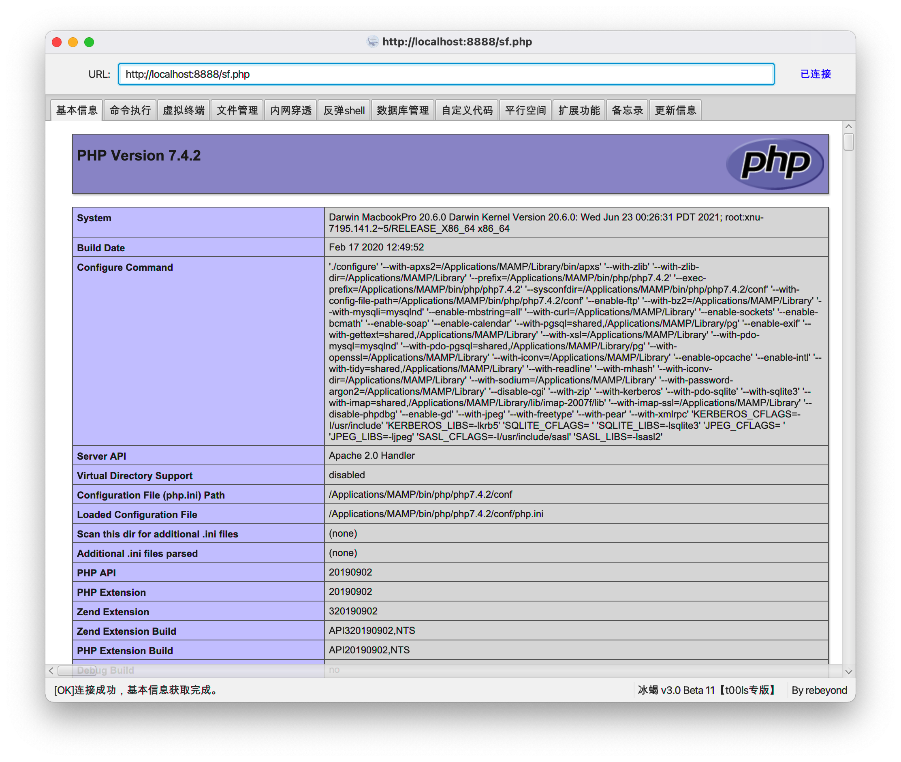

## Skyscorpion 🌟【天蝎】

   

### Link

https://github.com/shack2/skyscorpion

### About

天蝎权限管理工具采用 Java平台的 JavaFX 技术开发的桌面客户端，支持跨平台运行，目前基于JDK1.8开发，天蝎权限管理工具基于冰蝎加密流量进行 WebShell通信管理的原理，目前实现了jsp、aspx、php、asp端的常用操作功能，在原基础上，优化了大文件上传下载、Socket代理的问题，修改了部分API接口代码。

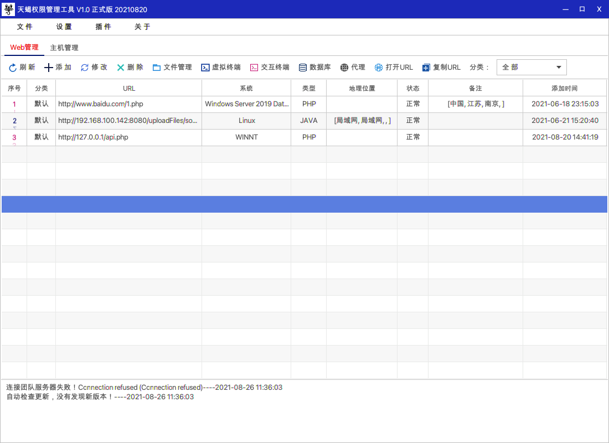


## AntSword【蚁剑】

   

### Link

https://github.com/AntSwordProject/antSword

### About

中国蚁剑是一款开源的跨平台网站管理工具，它主要面向于合法授权的渗透测试安全人员以及进行常规操作的网站管理员。

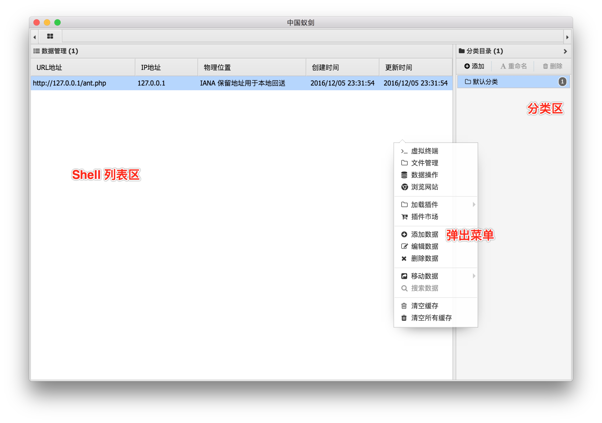


## Platypus 🌟【Linux】

   

### Link

https://github.com/WangYihang/Platypus

https://platypus-reverse-shell.vercel.app/quick-start/

### About

Platypus 是一款支持**多会话**的**交互式**反向 Shell 管理器。

在实际的渗透测试中，为了解决 Netcat/Socat 等工具在文件传输、多会话管理方面的不足。该工具在多会话管理的基础上增加了在渗透测试中更加有用的功能（如：**交互式 Shell**、**文件操作**、**隧道**等），可以更方便灵活地对反向 Shell 会话进行管理。


## Viper 🌟【C&C】

   

### Link

https://github.com/FunnyWolf/Viper

https://www.yuque.com/vipersec

### About

- Viper(炫彩蛇)是一款图形化内网渗透工具,将内网渗透过程中常用的战术及技术进行模块化及武器化.
- Viper(炫彩蛇)集成杀软绕过,内网隧道,文件管理,命令行等基础功能.
- Viper(炫彩蛇)当前已集成70+个模块,覆盖初始访问/持久化/权限提升/防御绕过/凭证访问/信息收集/横向移动等大类.
- Viper(炫彩蛇)目标是帮助红队工程师提高攻击效率,简化操作,降低技术门槛.
- Viper(炫彩蛇)支持在浏览器中运行原生msfconsole,且支持多人协作.


## PUPY 🌟【C&C】

   

### Link

https://github.com/n1nj4sec/pupy

[Pupy利用分析-Windows平台下的功能](https://3gstudent.github.io/Pupy%E5%88%A9%E7%94%A8%E5%88%86%E6%9E%90-Windows%E5%B9%B3%E5%8F%B0%E4%B8%8B%E7%9A%84%E5%8A%9F%E8%83%BD)

### About

Pupy是一个用 Python 编写、开源的跨平台（Windows、Linux、OSX、Android）远程管理和后期开发工具

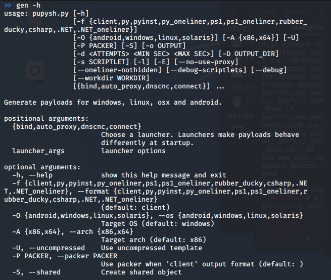


# 0x05 隧道构建

## NPS 🌟【综合】

   

### Link

https://github.com/ehang-io/nps

https://ehang.io/nps/documents

### About

一款轻量级、高性能、功能强大的内网穿透代理服务器。支持tcp、udp、socks5、http等几乎所有流量转发，可用来访问内网网站、本地支付接口调试、ssh访问、远程桌面，内网dns解析、内网socks5代理等等，并带有功能强大的web管理端。

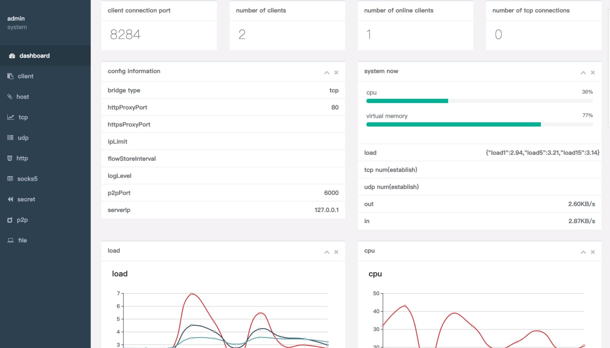


## FRP【综合】

   

### Link

https://github.com/fatedier/frp

### About

frp 是一个专注于内网穿透的高性能的反向代理应用，支持 TCP、UDP、HTTP、HTTPS 等多种协议。可以将内网服务以安全、便捷的方式通过具有公网 IP 节点的中转暴露到公网。

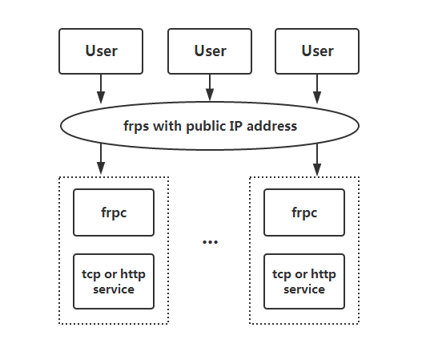

## Goproxy 🌟【综合】

   

### Link

https://github.com/snail007/goproxy

https://snail007.host900.com/goproxy/manual/zh/#/

### About

Goproxy 是 golang 实现的高性能 http ,https ,websocket ,tcp ,socks5 代理服务器

- 链式代理，程序本身可以作为一级代理，如果设置了上级代理那么可以作为二级代理，乃至N级代理。
- 多协议支持，支持HTTP(S)，TCP，UDP，Websocket，SOCKS5代理。
- [协议支持，HTTP(S)，SOCKS5代理支持KCP协议传输数据，降低延迟，提升浏览体验。

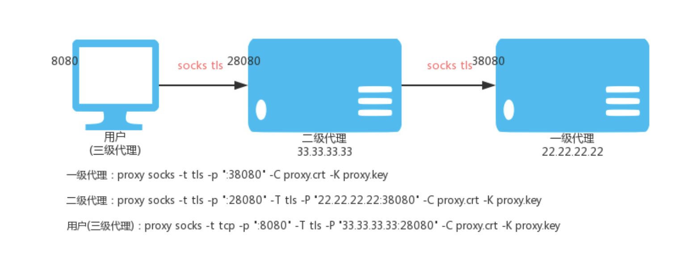


## IOX【端口转发】

   

### Link

https://github.com/EddieIvan01/iox

### About

端口转发 & 内网代理工具，功能类似于`lcx` / `ew`，但是比它们更好

- 流量加密（可选）
- 友好的命令行参数
- 逻辑优化
- UDP流量转发
- 反向代理模式中使用TCP多路复用


## Gost【多级】

   

### Link

https://github.com/ginuerzh/gost

### About

GO语言实现的安全隧道

**特性**

- 多端口监听
- 可设置转发代理，支持多级转发(代理链)
- 支持标准HTTP/HTTPS/HTTP2/SOCKS4(A)/SOCKS5代理协议
- Web代理支持[探测防御](https://docs.ginuerzh.xyz/gost/probe_resist/)
- [支持多种隧道类型](https://docs.ginuerzh.xyz/gost/configuration/)
- [SOCKS5代理支持TLS协商加密](https://docs.ginuerzh.xyz/gost/socks/)
- [Tunnel UDP over TCP](https://docs.ginuerzh.xyz/gost/socks/)
- [TCP/UDP透明代理](https://docs.ginuerzh.xyz/gost/redirect/)
- [本地/远程TCP/UDP端口转发](https://docs.ginuerzh.xyz/gost/port-forwarding/)
- [支持Shadowsocks(TCP/UDP)协议](https://docs.ginuerzh.xyz/gost/ss/)
- [支持SNI代理](https://docs.ginuerzh.xyz/gost/sni/)
- [权限控制](https://docs.ginuerzh.xyz/gost/permission/)
- [负载均衡](https://docs.ginuerzh.xyz/gost/load-balancing/)
- [路由控制](https://docs.ginuerzh.xyz/gost/bypass/)
- DNS[解析](https://docs.ginuerzh.xyz/gost/resolver/)和[代理](https://docs.ginuerzh.xyz/gost/dns/)
- [TUN/TAP设备](https://docs.ginuerzh.xyz/gost/tuntap/)

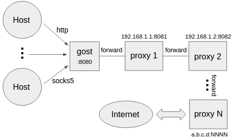


## Venom【多级】

   

### Link

https://github.com/Dliv3/Venom

### About

Venom是一款为渗透测试人员设计的使用Go开发的多级代理工具。

Venom可将多个节点进行连接，然后以节点为跳板，构建多级代理。

渗透测试人员可以使用Venom轻松地将网络流量代理到多层内网，并轻松地管理代理节点。

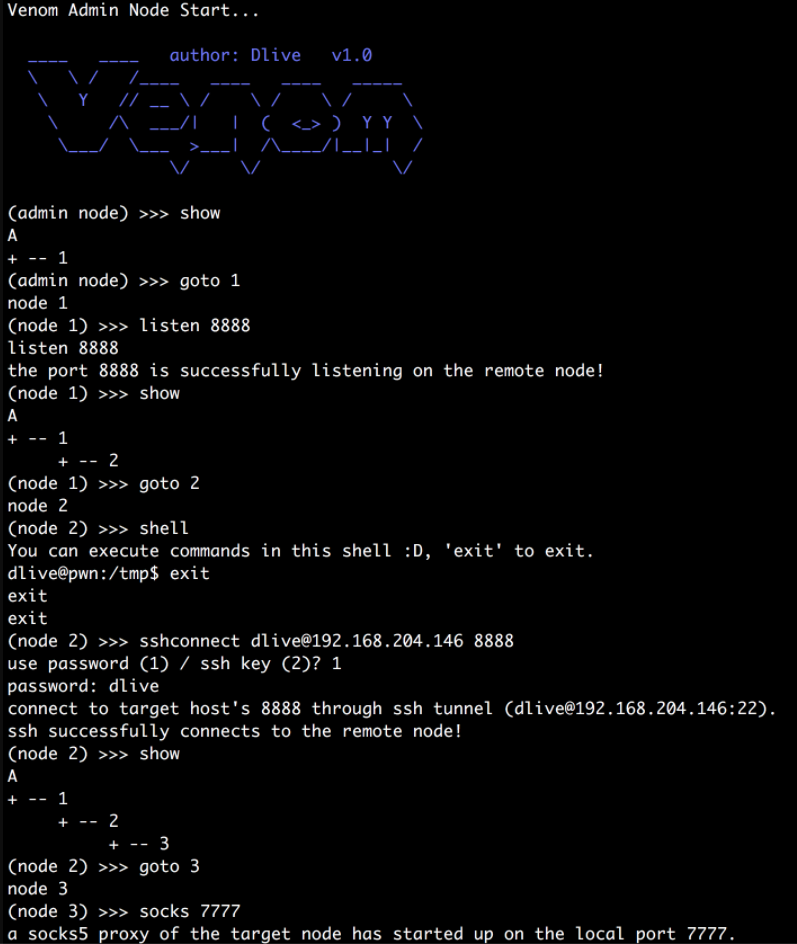


## Stowaway 🌟【多级】

   

### Link

https://github.com/ph4ntonn/Stowaway

### About

Stowaway是一个利用go语言编写、专为渗透测试工作者制作的多级代理工具

用户可使用此程序将外部流量通过多个节点代理至内网，突破内网访问限制，构造树状节点网络，并轻松实现管理功能


## Pystinger【Webshell】

   

### Link

https://github.com/FunnyWolf/pystinger

### About

Bypass firewall for traffic forwarding using webshell 一款使用webshell进行流量转发的出网工具

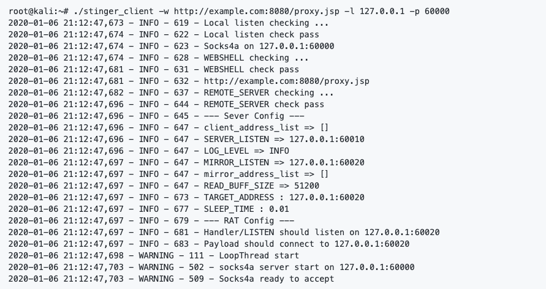


## Neo-reGeorg 🌟【Webshell】

   

### Link

https://github.com/L-codes/Neo-reGeorg

### About

**Neo-reGeorg** 是一个旨在积极重构 [reGeorg](https://github.com/sensepost/reGeorg) 的项目，目的是：

- 提高 tunnel 连接安全性
- 提高可用性，避免特征检测
- 提高传输内容保密性
- 应对更多的网络环境场景

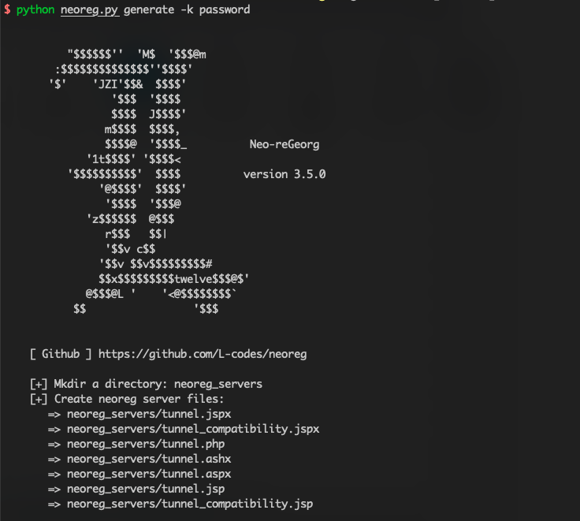


## ABPTTS【Webshell】

   

### Link

https://github.com/nccgroup/ABPTTS

[内网渗透--突破安全策略上线CS](https://xz.aliyun.com/t/10410)

### About

用于web应用服务器的HTTP/HTTPS上的TCP隧道

**在某些特定场景下 ABPTTS 有奇效**

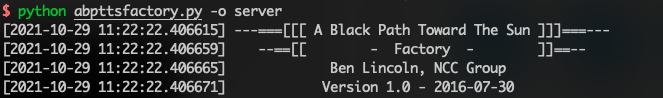


## Pingtunnel【ICMP】

   

### Link

https://github.com/esrrhs/pingtunnel

### About

pingtunnel 是把 tcp/udp/sock5 流量伪装成 icmp 流量进行转发的工具

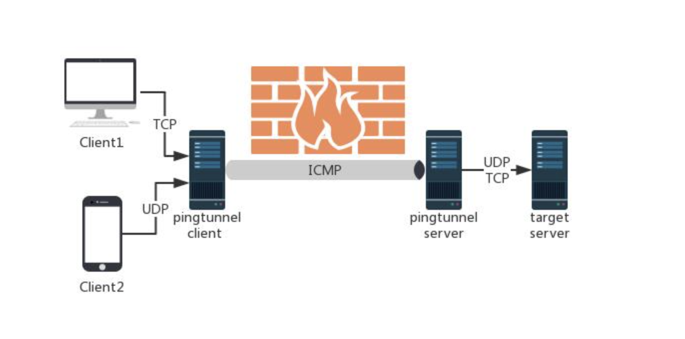


## SocksOverRDP【RDP】

   

### Link

https://github.com/nccgroup/SocksOverRDP

[利用 RDP 协议搭建 Socks5 代理隧道](https://whoamianony.top/2021/08/05/%E6%B8%97%E9%80%8F%E6%B5%8B%E8%AF%95/%E5%86%85%E7%BD%91%E6%B8%97%E9%80%8F%E6%B5%8B%E8%AF%95/%E5%86%85%E7%BD%91%E6%B8%97%E9%80%8F%E6%B5%8B%E8%AF%95%EF%BC%9A%E5%88%A9%E7%94%A8%20RDP%20%E5%8D%8F%E8%AE%AE%E6%90%AD%E5%BB%BA%20Socks5%20%E4%BB%A3%E7%90%86%E9%9A%A7%E9%81%93/)

### About

Socks5/4/4a 对远程桌面协议 / 终端服务 / Citrix/ XenApp / XenDesktop 的代理支持

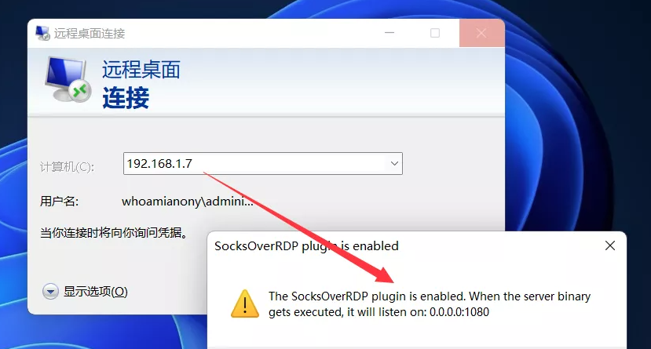


# 0x06 内网扫描

## LadonGo【综合】

   

### Link

https://github.com/k8gege/LadonGo

### About

LadonGo一款开源内网渗透扫描器框架，使用它可轻松一键探测C段、B段、A段存活主机、指纹识别、端口扫描、密码爆破、远程执行、高危漏洞检测等。

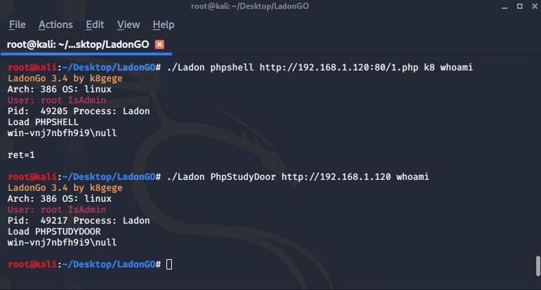


## Fscan 🌟【综合】

   

### Link

https://github.com/shadow1ng/fscan

### About

一款内网综合扫描工具，方便一键自动化、全方位漏扫扫描。
支持主机存活探测、端口扫描、常见服务的爆破、ms17010、redis批量写公钥、计划任务反弹shell、读取win网卡信息、web指纹识别、web漏洞扫描、netbios探测、域控识别等功能。

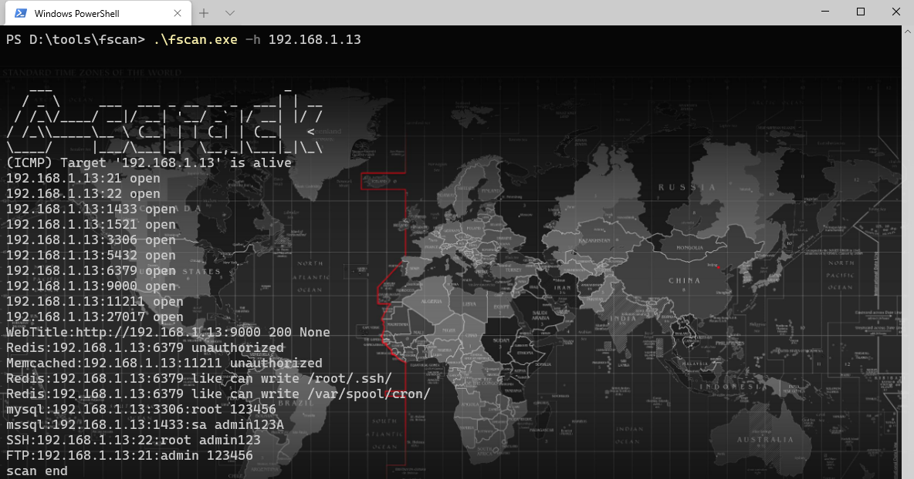


## Railgun 🌟【综合】

   

### Link

https://github.com/lz520520/railgun

### About

Railgun为一款GUI界面的渗透工具，将部分人工经验转换为自动化，集成了渗透过程中常用到的一些功能，目前集成了端口扫描、端口爆破、web指纹扫描、漏洞扫描、漏洞利用以及编码转换功能，后续会持续更新。

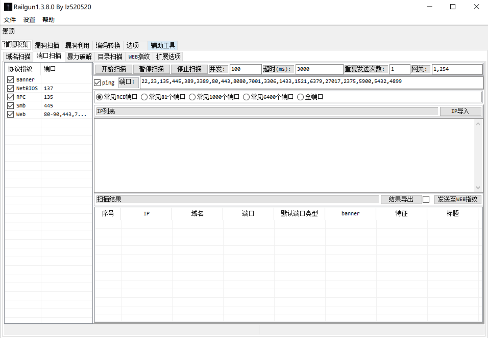


## ALLiN【综合】

   

### Link

https://github.com/P1-Team/AlliN

### About

一款轻便、小巧、快速、全面的扫描工具。多用于渗透前资产收集和渗透后内网横向渗透。

- python2.7 - python3.x 无依赖支持。
- 被动识别站点的一些架构信息，组件信息，框架信息，指纹数量1000+。
- 被动识别访问站点是否是云上站点。
- 对导入资产扫描支持相对比较完善，几乎支持任意格式资产。

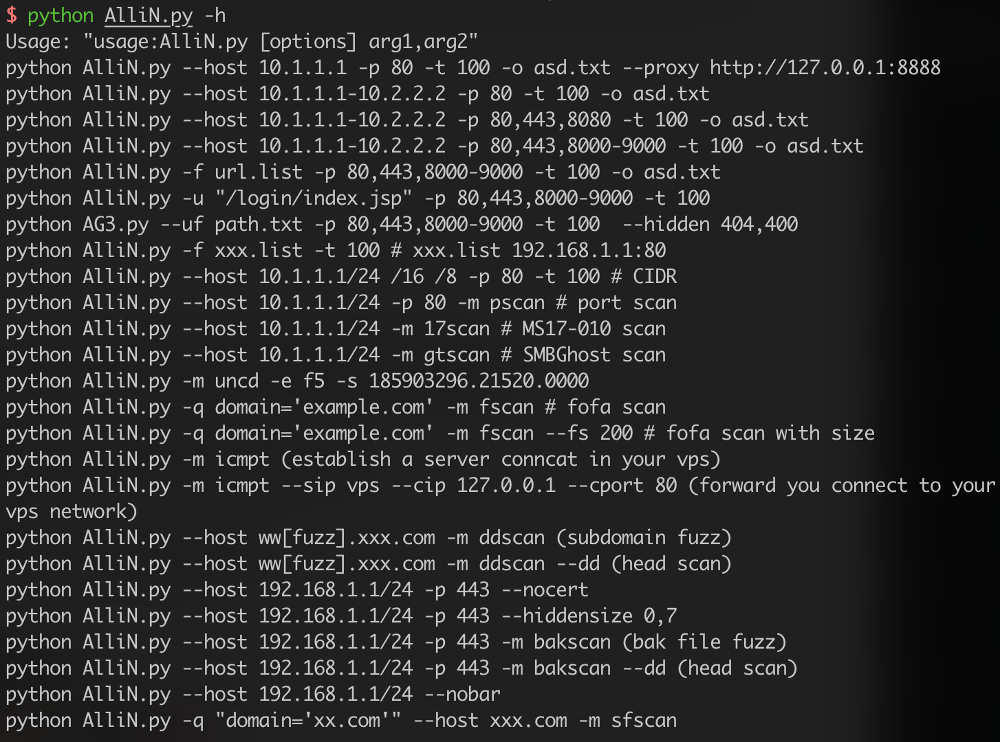


## Scaninfo【综合】

   

### Link

https://github.com/redtoolskobe/scaninfo

### About

开源、轻量、快速、跨平台 的红队内外网打点扫描器

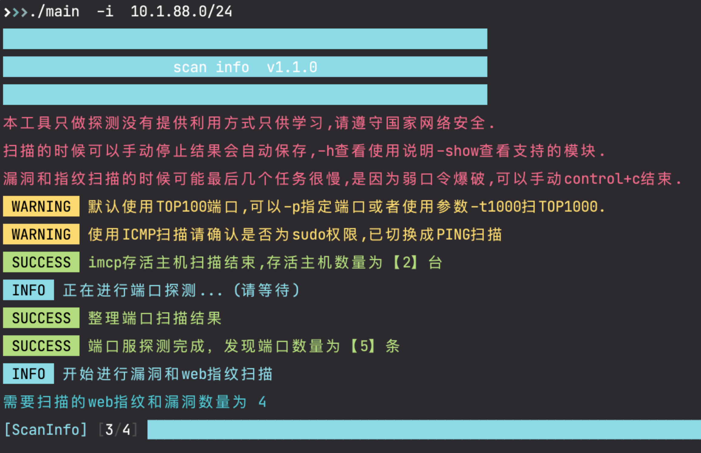


## ServerScan【端口/服务】

   

### Link

https://github.com/Adminisme/ServerScan

### About

一款使用**Golang**开发且适用于攻防演习**内网横向信息收集**的**高并发**网络扫描、服务探测工具。

**支持扫描结果回显至 CobaltStrike**

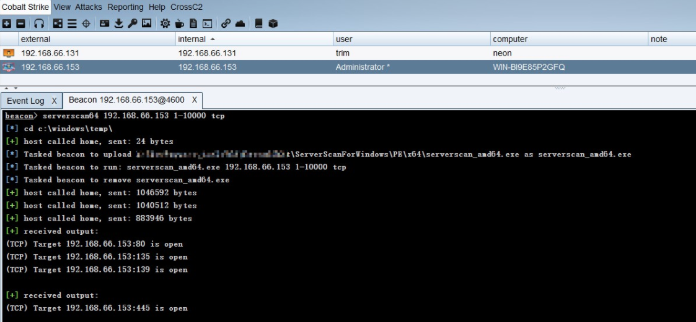


## Netspy 🌟【存活网段】

   

### Link

https://github.com/shmilylty/netspy

### About

一款快速探测内网可达网段工具

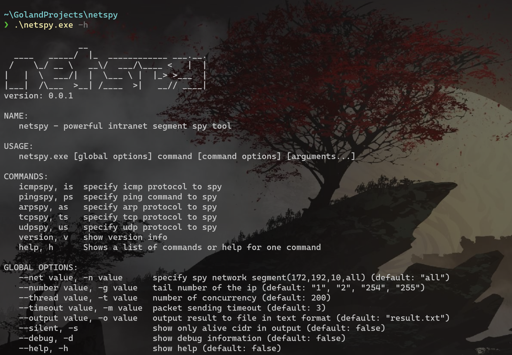


## Kscan【存活/爆破】

   

### Link

https://github.com/lcvvvv/kscan

### About

Kscan是一款轻量级的资产发现工具，可针对IP/IP段或资产列表进行端口扫描以及TCP指纹识别和Banner抓取，在不发送更多的数据包的情况下尽可能的获取端口更多信息。 并且针对扫描结果进行自动化暴力破解，且是go平台首款开源的RDP暴力破解工具。

- `--spy` 可在内网中进行自动化存活网段探测

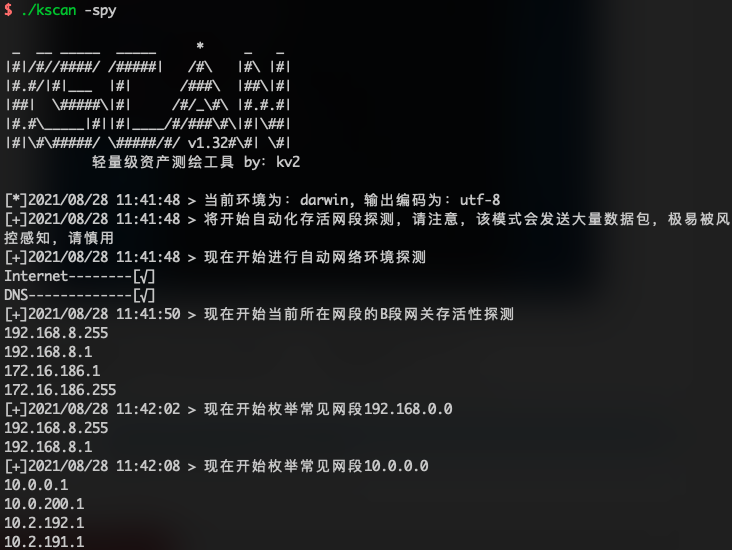


# 0x07 凭证获取

## Mimikatz 🌟【猕猴桃】

   

### Link

https://github.com/gentilkiwi/mimikatz

### About

使用 Windows 安全性的一个小工具


## LaZagne 🌟【综合】

   

### Link

https://github.com/AlessandroZ/LaZagne

### About

一键抓取目标机器上存储的所有明文密码

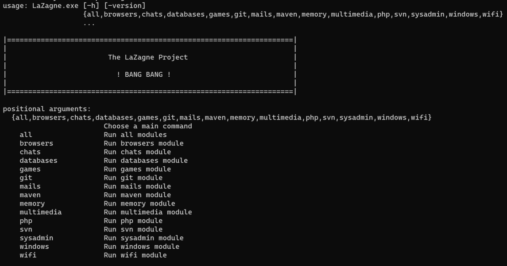


## BrowserGhost【浏览器】

   

### Link

https://github.com/QAX-A-Team/BrowserGhost

### About

一个抓取浏览器密码的工具

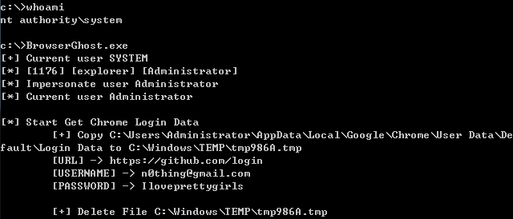


## HackBrowserData 🌟【浏览器】

   

### Link

https://github.com/moonD4rk/HackBrowserData

### About

一款可全平台运行的浏览器数据导出解密工具

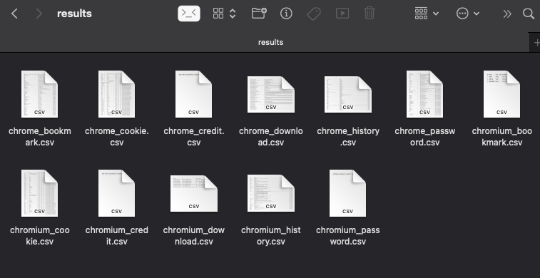


## 360SafeBrowsergetpass【浏览器】

   

### Link

https://github.com/hayasec/360SafeBrowsergetpass

### About

一键辅助抓取360安全浏览器密码的CobaltStrike脚本以及解密小工具

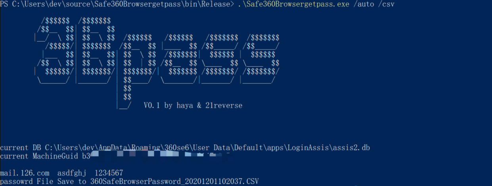


## Sunflower_get_Password【向日葵】

   

### Link

https://github.com/wafinfo/Sunflower_get_Password

### About

一款针对向日葵的识别码和验证码提取工具

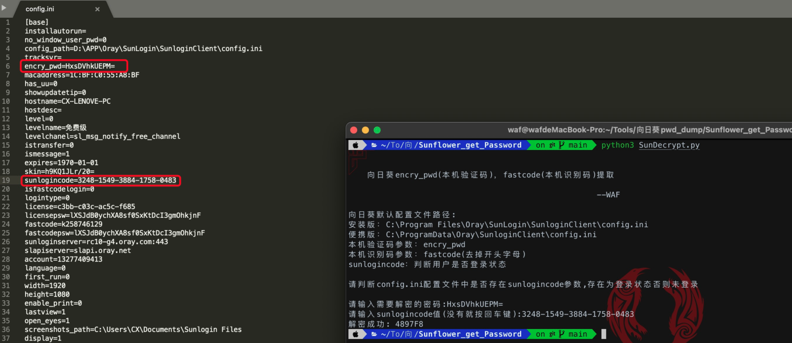


# 0x08 横向移动

## Impacket 🌟【综合】

   

### Link

https://github.com/SecureAuthCorp/impacket

### About

Impacket 是用于处理网络协议的 Python 类的集合

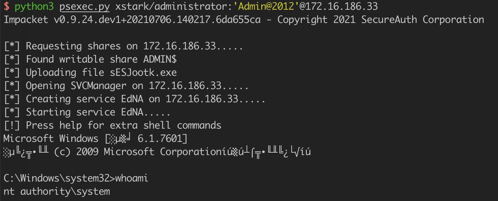


## CheeseTools【综合】

   

### Link

https://github.com/klezVirus/CheeseTools

### About

用于横向移动 / 代码执行的工具

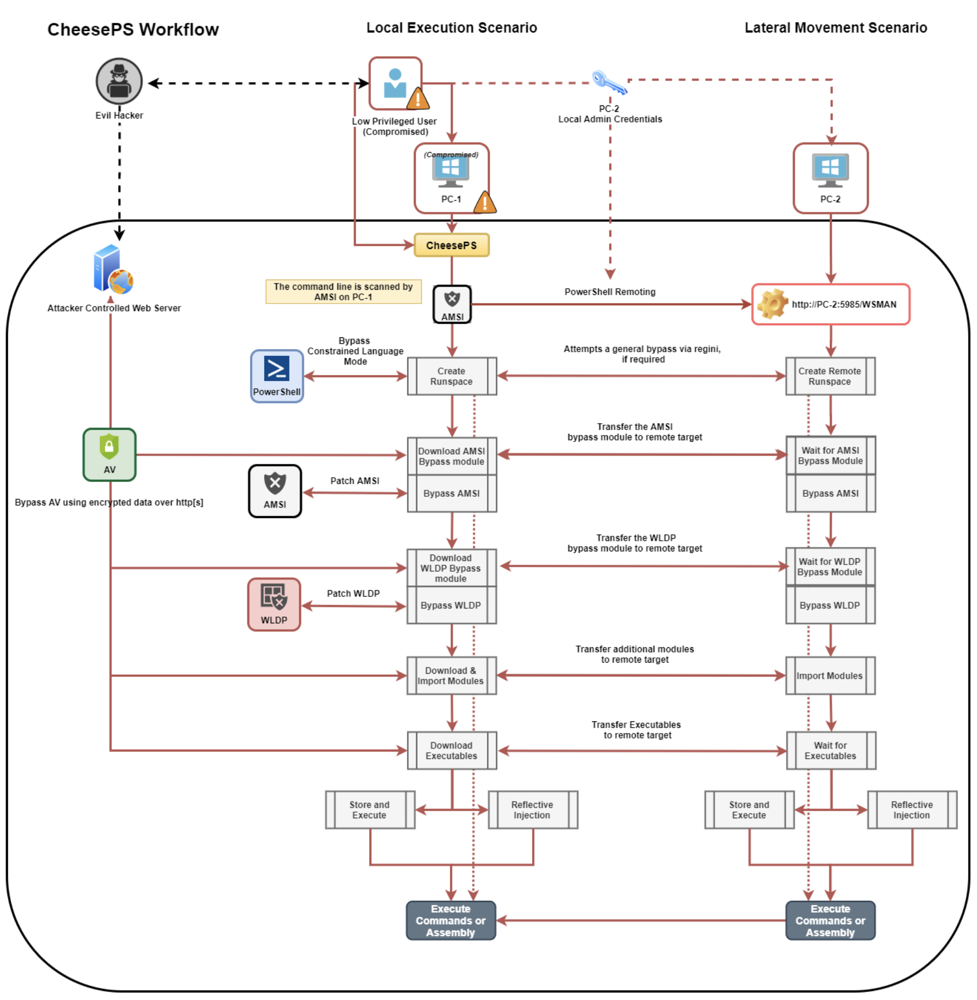


## CrackMapExec 🌟【Exec】

   

### Link

https://github.com/byt3bl33d3r/CrackMapExec

### About

横向移动中的瑞士军刀

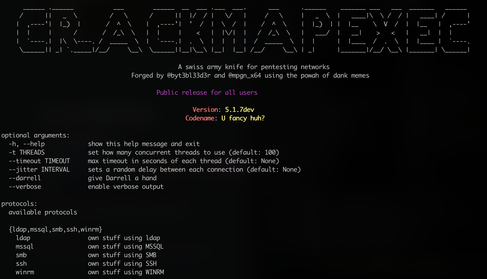


## WMIHACKER【Exec】

   

### Link

https://github.com/rootclay/WMIHACKER

### About

横向移动命令执行测试工具 (无需445端口)

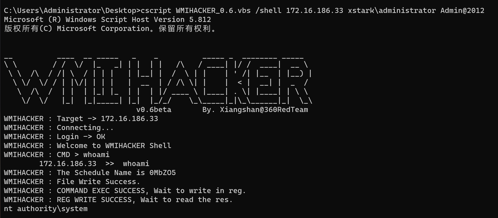


## Kerbrute【Domain】

   

### Link

https://github.com/ropnop/kerbrute

### About

通过 Kerberos 协议爆破 Active Directory 账户

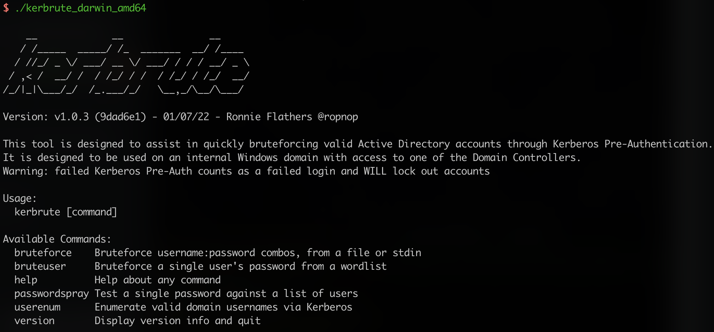

# 0x09 基础设施

## F8X 🌟【环境部署】

   

### Link

https://github.com/ffffffff0x/f8x

### About

一款红/蓝队环境自动化部署工具,支持多种场景,渗透,开发,代理环境,服务可选项等

**用于在 VPS 上快速部署红 / 蓝队设施所需要的各类服务**

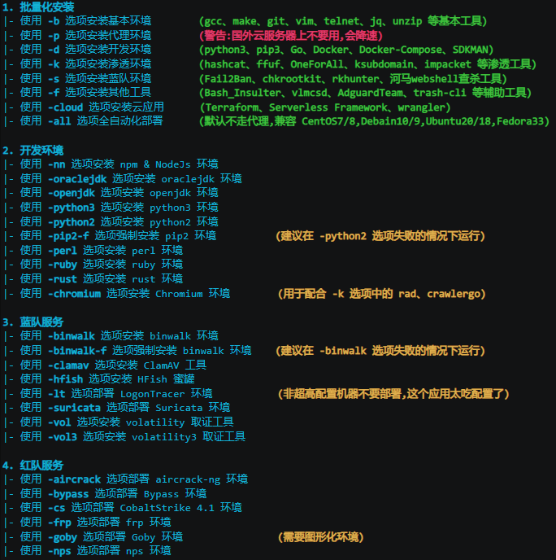

## Conote-community 🌟【Platform】

   

### Link

https://github.com/phith0n/conote-community

[CoNote使用文档](https://phithon.gitbooks.io/conote/content/)

### About

CoNote 综合安全测试平台（社区版）

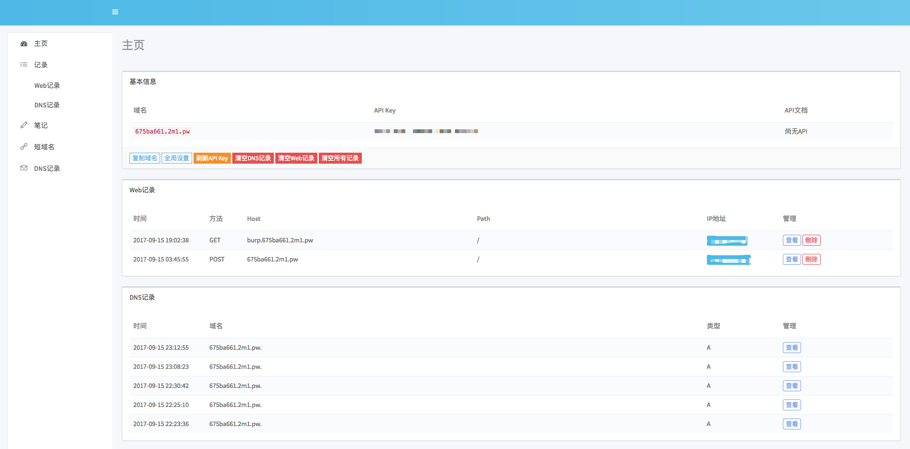


## Yakit【Platform】

   

### Link

https://github.com/yaklang/yakit

### About

Burpsuite 的年轻中国挑战者

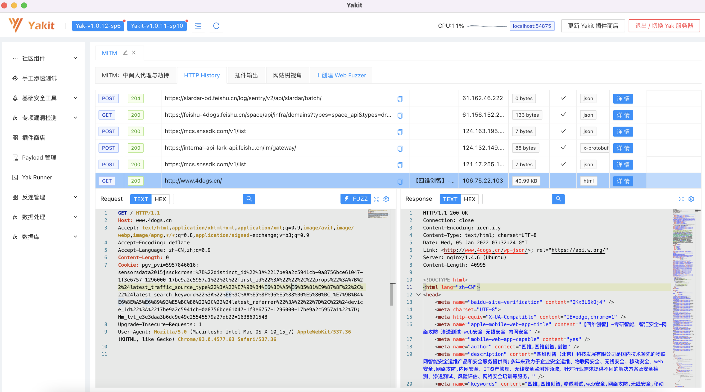


## Fofa_viewer 🌟【Fofa】

   

### Link

https://github.com/wgpsec/fofa_viewer

### About

一款使用 javafx 编写跨平台的 Fofa 客户端

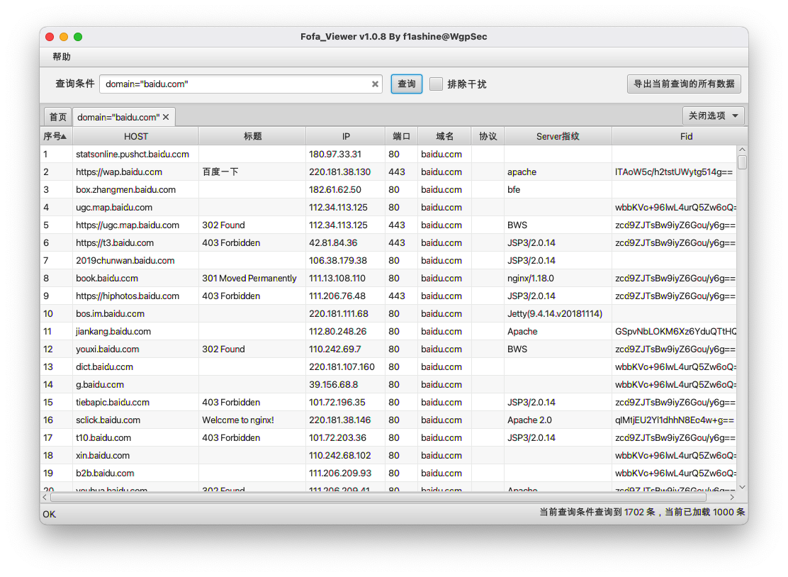

## 1earn【Wiki】

   

### Link

https://github.com/ffffffff0x/1earn

https://ffffffff0x.gitbook.io/1earn

### About

安全知识框架,内容包括不仅限于 web安全、工控安全、取证、应急、蓝队设施部署、后渗透、Linux安全、各类靶机writup

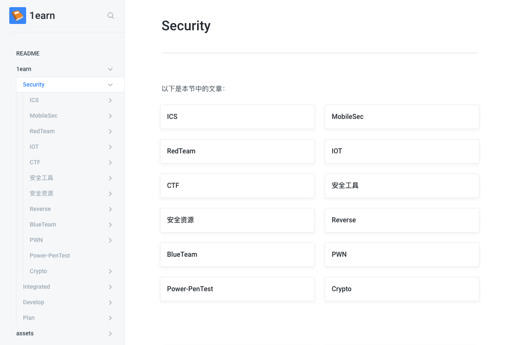


## Redteam_vul【Wiki】

  

### Link

https://github.com/r0eXpeR/redteam_vul

### About

红队作战中比较常遇到的一些重点系统漏洞整理

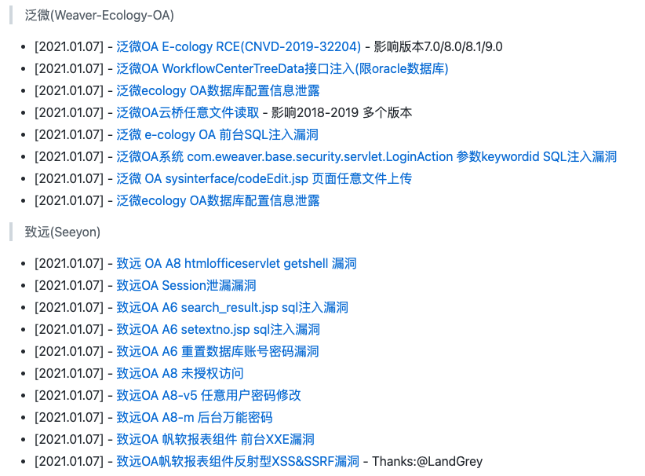

## Supplier【wiki】

  

### Link

https://github.com/r0eXpeR/supplier

### About

主流供应商的一些攻击性漏洞汇总

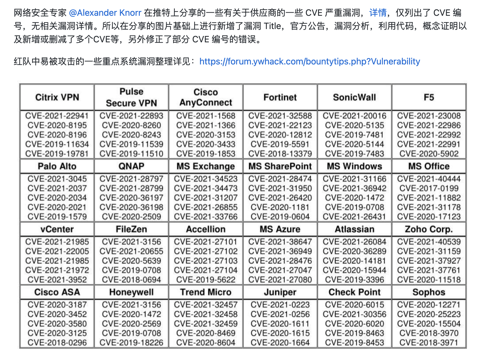


## Awesome CobaltStrike【Wiki】

  

### Link

https://github.com/zer0yu/Awesome-CobaltStrike

### About

Cobaltstrike的相关资源汇总


## BurpSuite-collections【Wiki】

   

### Link

https://github.com/Mr-xn/BurpSuite-collections

### About

有关 Burpsuite 的插件(非商店)，文章以及使用技巧的收集

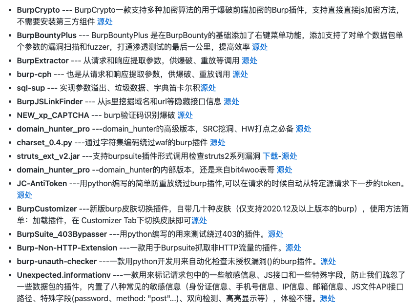


## Intranet_Penetration_Tips【Wiki】

  

### Link

https://github.com/Ridter/Intranet_Penetration_Tips

### About

内网渗透 Tips

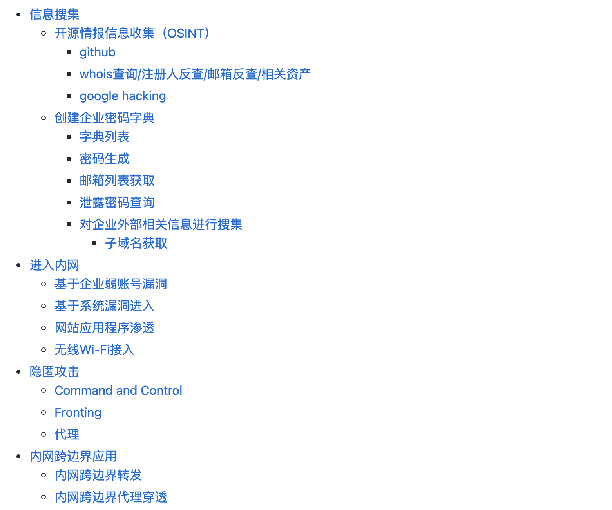


## PeiQi-WIKI-POC【Poc】

   

### Link

https://github.com/PeiQi0/PeiQi-WIKI-POC

http://wiki.peiqi.tech

### About

鹿不在侧，鲸不予游🐋（附赠 GobyPOC）


## Vulnerability【Poc】

  

### Link

https://github.com/EdgeSecurityTeam/Vulnerability

### About

此项目将不定期从棱角社区对外进行公布一些最新漏洞

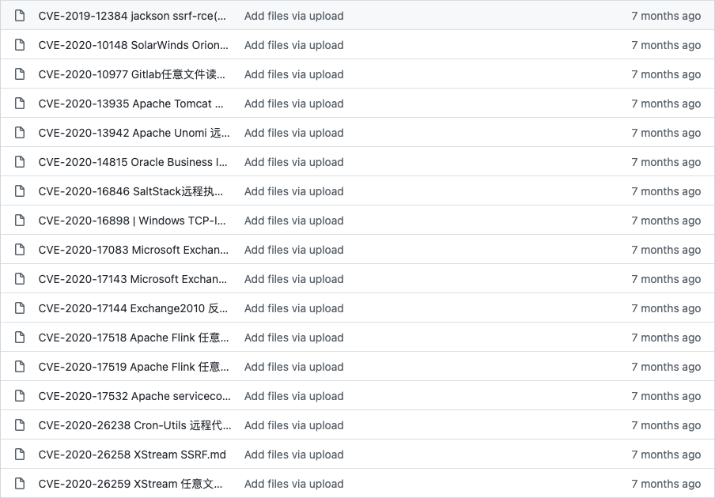


## Proxychains-windows【代理】

   

### Link

https://github.com/shunf4/proxychains-windows

### About

Proxychains.exe 是一个适用于 Win32(Windows) 和 Cygwin 平台的命令行强制代理工具（Proxifier）。它能够截获大多数 Win32 或 Cygwin 程序的 TCP 连接，强制它们通过一个或多个 SOCKS5 代理隧道。

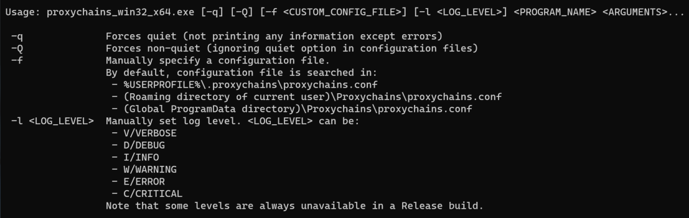


## CSAgent【Cobalt Strike】

   

### Link

https://github.com/Twi1ight/CSAgent

### About

CobaltStrike 4.x通用白嫖及**汉化加载器**

对主界面、Console、命令帮助、生成payload、监听器、偏好设置等均进行了彻底的汉化


## DNSlog-GO【Dnslog】

   

### Link

https://github.com/lanyi1998/DNSlog-GO

### About

DNSLog-GO 是一款golang编写的监控 DNS 解析记录的工具，自带WEB界面

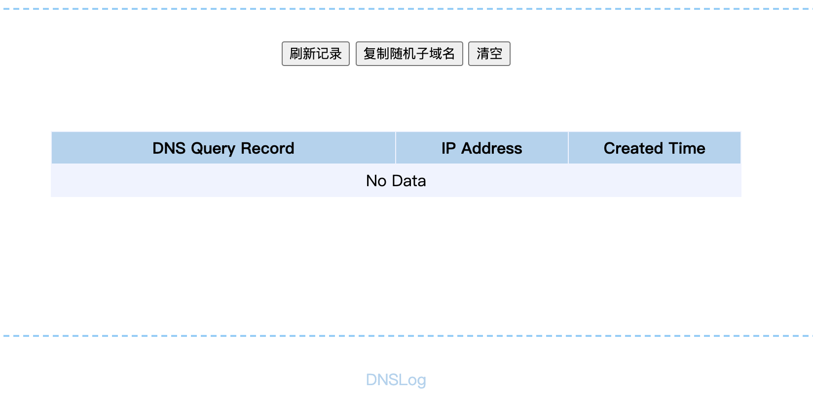


## ExpDemo-JavaFX【JavaFX】

   

### Link

https://github.com/yhy0/ExpDemo-JavaFX

### About

帮助安全人员快速构建一个图形化的、跨平台的漏洞利用工具。

只需要了解 Java 基本的语法，参考自带的EXP例子，即可快速开发一款**属于你自己**的漏洞利用工具，建立自己的漏洞利用库。

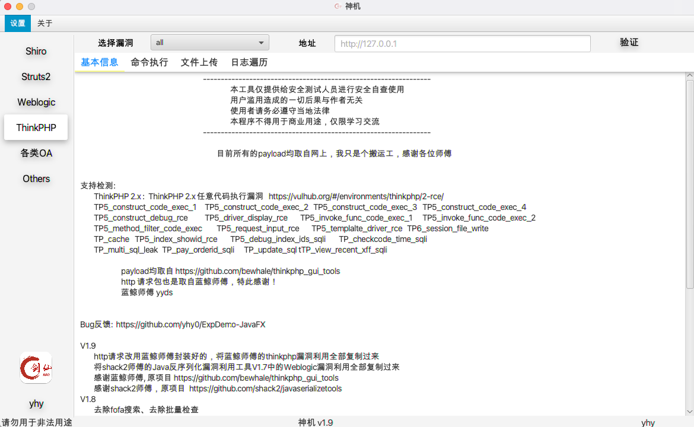
